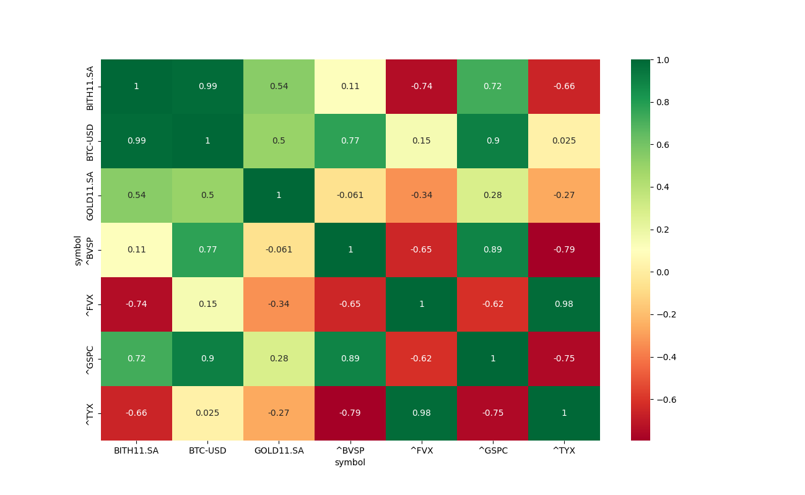

# How to run it

## Create python virtual environment
```
$ python -m venv ~/venv-stats
```

## Source the virtual environment 
```
$ source ~/venv-stats/bin/activate
```

### Instal dependencies
```
(venv-stats) $ pip install -r requirements.txt
```

### Call forecasting example
```
(venv-stats) $ python examples/forecasting-stock-price.py 
```


### Call correlation example
```
(venv-stats) $ python examples/assets-correlation.py
```


